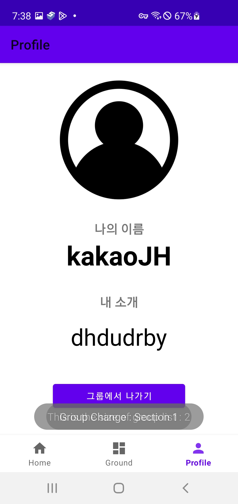

# weGround

> FlowCamp Week2 2분반 3팀

- 그룹 가입 기능과 한줄 일기 작성 기능이 있는 Kotlin 기반의 안드로이드 어플리케이션입니다.
- 그룹에 가입 및 탈퇴할 수 있습니다.
- 그룹 멤버들 간 공유되는 한줄 일기를 작성하고 좋아요로 상호작용할 수 있습니다.
- 그룹 내의 닉네임과 한 줄 소개로 프로필을 설정할 수 있습니다.

### A. 개발 팀원

- [오지환](https://github.com/jihwan01)
- [박이내](https://github.com/YinaePark)
- [백엔드 레포지토리](https://github.com/weGround/weG_background)

### B. 개발 환경

- OS: Windows 11(22H2)
- Framework : Kotlin, nest.js
- Target : Android
- Language: Typescript
- IDE : Android Studio, VScode
- Database : mongoDB

---

### C. 어플리케이션 소개

### 1. 로그인 화면

|  |  |  |
| ----------------------------- | ------------------------------------------------- | --------------------------------------------------- |

#### Major features

- ID와 비밀번호를 입력한 후 sign up을 누르면 회원가입이 완료됩니다.
- 유효한 ID와 비밀번호를 입력한 후 sign in을 누르면 로그인이 완료됩니다.
- 유효하지 않은 ID와 비밀번호일 경우
- 소셜 로그인 버튼을 누르면 카카오 계정과 연동한 로그인 기능을 제공합니다.

#### 기술 설명

### 2. Home 탭

|  |  |
| -------------------------- | ------------------------------------------------ |

#### Major features

- 그룹의 한 줄 소개를 보여줍니다.
- 그룹에 가입한 멤버들을 보여줍니다.
- 그룹의 대표 이미지를 보여줍니다.

#### 기술 설명

### 3. Ground 탭

|  |  |  |
| ---------------------------- | ----------------------------------------------------- | --------------------------------------------------- |

#### Major features

- 한줄 일기를 작성할 수 있습니다.
- 그룹 멤버가 남긴 한줄 일기에 좋아요를 누를 수 있습니다.

#### 기술 설명

### 4. Profile 탭

|  |  |
| ----------------------------------- | ------------------------------------------------------------ |

#### Magor features

- 그룹 별로 설정한 나의 이름, 한줄 소개, 프로필 사진을 보여줍니다.
- 나의 이름, 한줄 소개를 수정할 수 있습니다.

#### 기술 설명

### 5. Groups 탭

|  |  |  |
| -------------------------------- | ---------------------------------------------------- | --------------------------------------------- |

#### Major features

- 내 그룹을 관리합니다.
- 그룹을 만들 수 있습니다.
- 그룹 이름을 입력해 그룹에 참여할 수 있습니다.

#### 기술 설명
